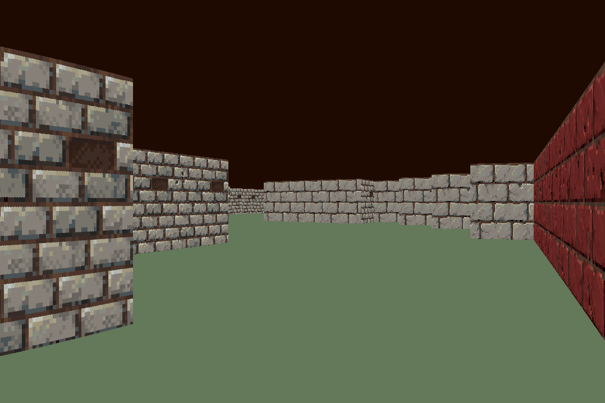
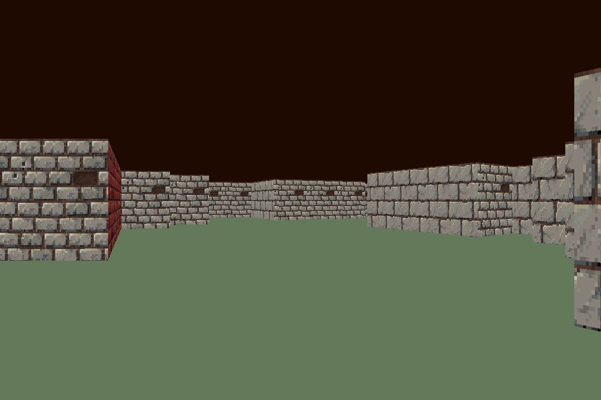

# cub3d

This project is a simple raycasting game developed in C for the 42 curriculum, compatible with Linux and MacOS.

# Screenshots




## Contributors

- [sboulain](https://github.com/P1tayaa)
- [omathot](https://github.com/omathot)
- using the [MLX42](https://github.com/codam-coding-college/MLX42)
## Installation

1. Clone the repository:
   ```bash
   git clone <repository_url>
   cd cub3d
   make test
   ```
2. Clean Up:
   ```bash
    make hardclean
    ```
